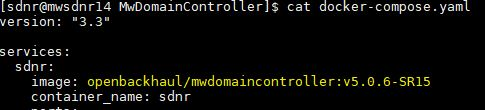

# ODL Controller Deployment:

### Pre-requisite:
1. Start mediator application
2. Start Mediator instance manager and create device instance from vendor LAB  
3. Docker should be available in VM
4. Configuration VM:CPU-2CORES,RAM-8G, Hard disk-100GB

## Creating Container:
Clone the controller repo from Openbackhaul site
> git clone https://github.com/openBackhaul/MwDomainController.git <br>
> cd MwDomainController

Planned ODL conatainer Respository and Version name to be updated in docker-compose.yaml file as shared and highlighted in below snippet
###### Sample snippet:
<br>

<br>

##### To start the ODL controller:
Create and start the container from downloaded docker image.
> docker-compose up -d 

##### To Stop the ODL controller:
> docker-compose down

Image will be installed in the VM and sample snippet shared below <br>
###### Sample snippet:
<br>

<br>


### Adding device into Controller:
Using below sample template user can add the device into controller.<br>

Mountname   - Device name to be added<br>
MPAddress	- Mediator IP address<br>
NetconfPort	- Port which is assigned by Mediator instance manager <br>
Username	- User is allowed to access ODL controller<br>
Password	- Password for the user allowed to access ODL controller<br>

url:
> http://{ODL-IP}:8181/rests/data/network-topology:network-topology/topology=topology-netconf/node={nodename}

Operation:
> PUT

Body:
```
{
    "network-topology:node": [
        {
            "node-id": "<<nodename>>",
            "netconf-node-topology:sleep-factor": "2.5",
            "netconf-node-topology:max-connection-attempts": 8,
            "netconf-node-topology:username": "<<username>>",
            "netconf-node-topology:password": "<<password>>",
            "netconf-node-topology:port": <<netconf_port>>,
            "netconf-node-topology:host": "<<mediatror IP>>",
            "netconf-node-optional:notification": {
                "subscribe": true,
                "stream-name": "NETCONF"
            }
        }
    ]
}
```
### Deleting device from Controller:

##### Deleting device from ODL using REST request:
url:
> http://{ODL-IP}:8181/rests/data/network-topology:network-topology/topology=topology-netconf/node={nodename}

Operation:
> DELETE

