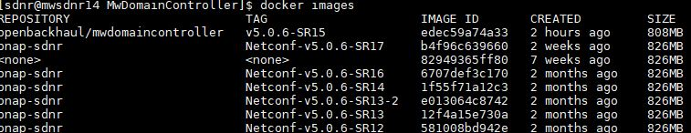

# MW Domain Controller
Documentation for the OpenDaylight based SDN Controller as it is used in the mobile backhaul network at Telefonica Germany.

## Installation

### Minimal resources

VM: CPU-2CORES, RAM-8G, Hard disk-100GB<br>
OS: NAME="Red Hat Enterprise Linux", VERSION="8.9 (Ootpa)"

### Proxy

Enable proxy setting to reach internet for accessing [Docker](https://hub.docker.com/) and [Openbackhaul](https://github.com/openBackhaul)

### Docker

Docker needs to be installed on the host machine where the SDN Controller will be deployed. More information on installing Docker [here](https://docs.docker.com/get-docker/).

### Docker-compose

Docker-compose is required on the host machine where the SDN Controller run. More information on installing docker-compose [here](https://docs.docker.com/compose/install/).

### Clone repository
Clone the controller repo from Openbackhaul site
> git clone https://github.com/openBackhaul/MwDomainController.git <br>
> cd MwDomainController

## Usage

### Pre-requisite
1. Start mediator application
2. Start Mediator instance manager and create device instance from vendor LAB  

### Start the SDN controller
Create and start the container from downloaded docker image:
> docker-compose up -d 

Image will be installed in the VM and sample snippet shared below:<br>
<br>

<br>

### Credentials

Use default SDN controller credentials as Basic auth in all REST requests:<br>
**username**: admin<br>
**password**: admin<br>

### Adding device into Controller
Using below sample template user can add the device into controller.<br>

nodename        - Unique device name to be added<br>
mediatror_IP	- Mediator IP address<br>
netconf_port	- Port which is assigned by Mediator instance manager (NETCONF server) <br>
username     	- Username to be used for accessing the device<br>
password    	- Password to be used for accessing the device<br>

URL:
> http://{SDN-CONTROLLER-IP}:8181/rests/data/network-topology:network-topology/topology=topology-netconf/node={nodename}

Operation:
> PUT

Headers (Basic auth with admin:admin):
> Authorization: Basic YWRtaW46YWRtaW4=

Body:
```
{
    "network-topology:node": [
        {
            "node-id": "<<nodename>>",
            "netconf-node-topology:sleep-factor": "1",
            "netconf-node-topology:max-connection-attempts": 8,
            "netconf-node-topology:username": "<<username>>",
            "netconf-node-topology:password": "<<password>>",
            "netconf-node-topology:port": <<netconf_port>>,
            "netconf-node-topology:host": "<<mediatror_IP>>",
            "netconf-node-optional:notification": {
                "subscribe": true,
                "stream-name": "NETCONF"
            }
        }
    ]
}
```

### Deleting device from Controller
If user need to delete the device from SDN controller, below request to be used

URL:
> http://{SDN-CONTROLLER-IP}:8181/rests/data/network-topology:network-topology/topology=topology-netconf/node={nodename}

Operation:
> DELETE

Headers (Basic auth with admin:admin):
> Authorization: Basic YWRtaW46YWRtaW4=

### Stop the SDN controller
If user trying to stop the SDN controller, below command to be used:
> docker-compose down
